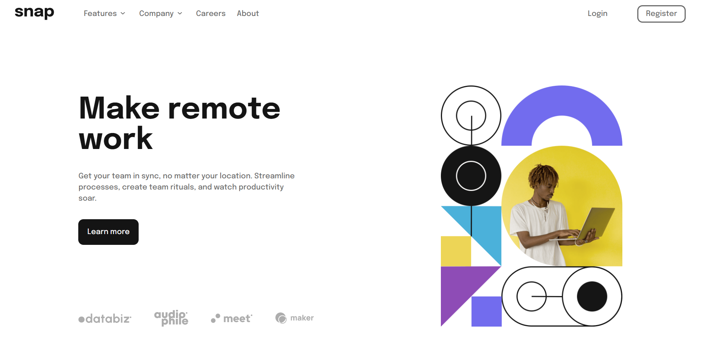

# Frontend Mentor - Intro section with dropdown navigation solution

This is a solution to the [Intro section with dropdown navigation challenge on Frontend Mentor](https://www.frontendmentor.io/challenges/intro-section-with-dropdown-navigation-ryaPetHE5). Frontend Mentor challenges help you improve your coding skills by building realistic projects. 

## Table of contents

- [Overview](#overview)
  - [The challenge](#the-challenge)
  - [Screenshot](#screenshot)
  - [Links](#links)
- [My process](#my-process)
  - [Built with](#built-with)
  - [What I learned](#what-i-learned)
  - [Continued development](#continued-development)
  - [Useful resources](#useful-resources)
- [Author](#author)
- [Acknowledgments](#acknowledgments)

**Note: Delete this note and update the table of contents based on what sections you keep.**

## Overview

### The challenge

Users should be able to:

- View the relevant dropdown menus on desktop and mobile when interacting with the navigation links
- View the optimal layout for the content depending on their device's screen size
- See hover states for all interactive elements on the page

### Screenshot



### Links

- Solution URL: [Frontend Mentor Solution](https://www.frontendmentor.io/solutions/responsive-intro-section-with-dropdown-with-css-flexbox-and-bem-BJMPlW8Bc)
- Live Site URL: [Intro Section with Dropdown](https://alosoft.github.io/frontend-mentor_intro-section-with-dropdown-navigation-main/)


### Built with

- Semantic HTML5 markup
- CSS custom properties
- Flexbox
- Desktop-first workflow


### What I learned

I challenged myself to create the dropdown without using javascript to show and hide them. I've never had to chain CSS selectors with the ```css :hover ``` or ```css ::after``` psuedo selector to select elements.
I used the same technique to change the arrow icon on hover
```css
.header__nav-list__item:hover .dropdown::after {
    content: url(./images/icon-arrow-up.svg);
}
```


## Author

- Website - [Raymond Adutwum Agyei](https://corps-ai.herokuapp.com)
- Frontend Mentor - [@alosoft](https://www.frontendmentor.io/profile/alosoft)
- Linkedin - [Raymond Adutwum Agyei](https://www.linkedin.com/in/raymond-adutwum-agyei-366929117/)

